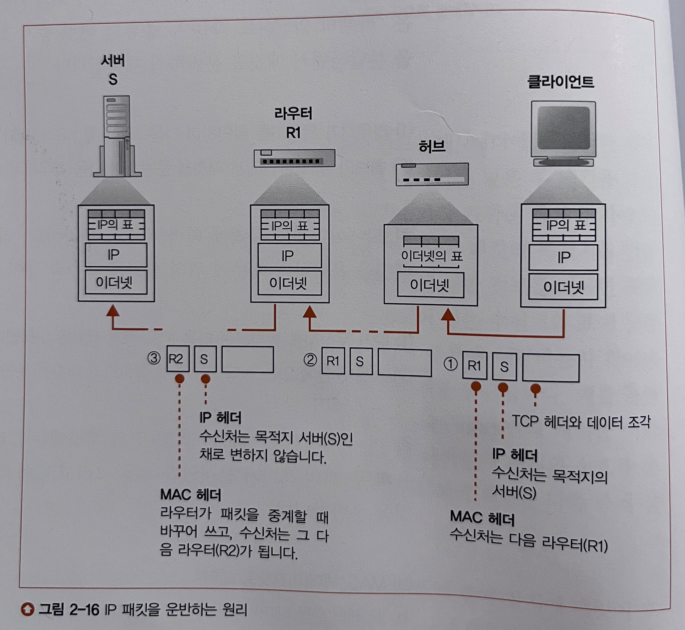
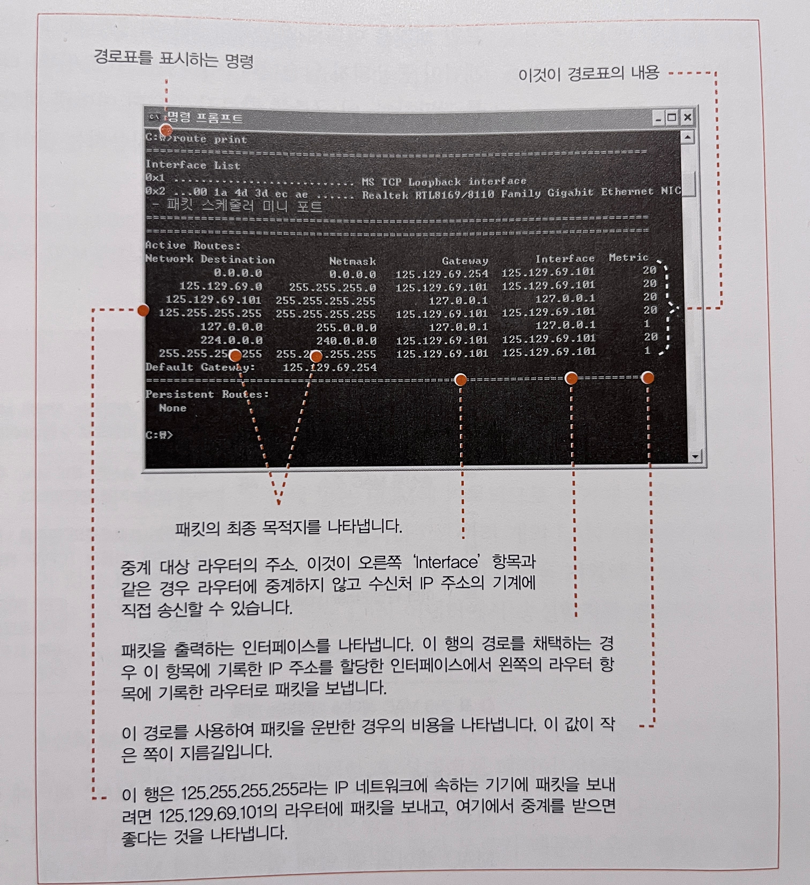
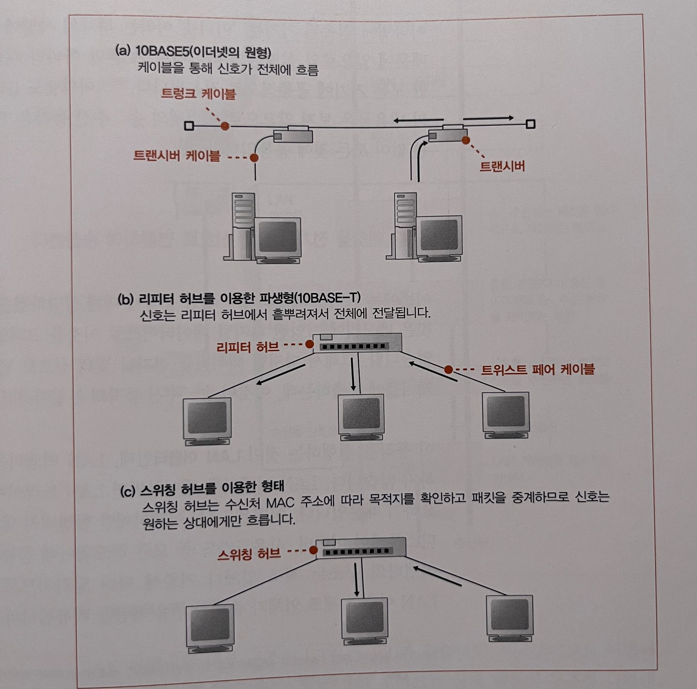

# 2장 TCP/IP의 데이터를 전기 신호로 만들어 보낸다 

핵심 포인트

- OS에 내장된 프로토콜 스택이 어떻게 송신을 의뢰하는지 설명한다.

- 프로토콜 스택과 LAN 어댑터

동작순서
1. 소켓을 작성한다.

2. 서버에 접속한다.

3. 데이터를 송/수신한다.

4. 서버에서 연결을 끊어 소켓을 말소한다.

5. IP와 이더넷의 패킷 송/수신 동작

6. UDP 프로토콜을 이용한 송/수신 동작

---

## 1. 소켓을 작성한다.

 

### 1. 프로토콜 스택의 내부 구성

- 네트워크를 제어하려면 OS에 내장된 프로토콜 스택(소프트웨어)와 LAN 어댑터(하드웨어)가 필요하다.

- 네트워크 계층 구조 : 아래쪽을 향하여 데이터 송/수신 등의 일을 의뢰한다.

    * 어플리케이션
    -> 네트워크 어플리케이션 : 어플리케이션에서 데이터 송신을 시작한다. 이때 소켓 라이브러리를 사용하여 리졸버로 DNS 서버를 조회하는 등의 동작을 실행한다.

    * OS
    -> 프로토콜 스택 : Transport Layer(TCP/UDP) 와 Network Layer(IP) 로 나뉜다.
       TCP를 사용하여 데이터를 송/수신하고 DNS 서버 조회 등 짧은 제어용 데이터를 송/수신하는 경우에는 UDP를 사용한다.
       IP 프로토콜로 패킷 송수신 동작을 제어한다. ICMP(패킷운반시 오류 통지, 제어용 메세지) 혹은 ARP(IP에 대응하는 MAC주소 조사)로 동작한다.
    
    * 드라이버 소프트웨어
    -> LAN 드라이버 : LAN 어댑터의 하드웨어를 제어한다.

    * 하드웨어
    -> LAN 어댑터 : 실제 송/수신 동작, 즉 케이블에 의해 신호를 송/수신하는 동작을 실행한다.

 

### 2. 소켓의 실체는 통신 제어용 제어 정보

- 소켓 내부에 제어 정보를 기록하는 메모리 영역이 존재한다. 여기에 통신 동작을 제어하기 위한 제어 정보를 기록한다. 대표적인 정보로는 통신 상대의 IP 주소, 포트 번호, 통신 동작 상태이다. 따라서, 제어 정보의 집합이 소켓의 실체이다.

- 프로토콜 스택은 소켓의 제어 정보를 참조하여 동작한다. 일정 시간 경과 후 응답이 오지 않으면 데이터를 재송신 한다. (즉, 경과 시간등을 기록한다)

- 소켓에는 통신 동작을 제어하기 위한 여러 가지 제어 정보가 기록되어 있다. 프로토콜 스택은 이것을 참조하여 다음에 무엇을 해야 하는지를 판단하는데, 이것이 소켓의 역할이다.

- 소켓을 만든다는 것
    * netstat(윈도우 경우) 명령어에 의해서 나오는 소켓 통신 정보에 해당 소켓에 대한 제어정보를 추가하는 것
        -> netstat 명령어 입력시 Local Address에 여러 IP 주소가 나온다면 여러 LAN 어댑터를 보유하고 있다는 뜻이다.
        -> IP가 0.0.0.0 으로 기재되는 것은 양측이 모두 통신을 시작하지 않아서 IP가 정해지지 않았기 때문이다.
    * 통신을 시작하는 부분의 상태를 기록하고 송수신 데이터를 일시적으로 저장하는 버퍼 메모리를 준비하는 것 등등

 

### 3. Socket을 호출했을 때의 동작

- 먼저 Socket 라이브러리의 socket 메서드를 호출하여 프로토콜 스택에 의뢰해 소켓을 하나 생성한다.

    * 프로토콜 스택은 소켓 한 개가 사용하는 메모리 영역을 확보한다.

    * 아직 통신 이전이면 초기 상태의 정보를 메모리에 기록한다.

    * 포로토콜 스택은 소켓에 대한 디스크립터를 어플리케이션에 알려준다.

    * 이 디스크립터를 통해 어플리케이션은 이후 데이터 송수신을 프로토콜 스택에 의뢰한다.

    * 디스크립터만 있으면 프로토콜 스택이 소켓의 통신 상태, 상대 소켓 등등의 기타 정보를 모두 알 수 있다. (어플리케이션은 해당 정보에 대해서 알 필요가 없다)

 

---

## 2. 서버에 접속한다.

 

### 1. 접속의 의미

- 어플리케이션은 소켓을 생성 후 connect 메서드를 호출한다. 그러면 프로토콜 스택은 자기쪽의 소켓을 서버측 소켓에 접속한다.

- 여기서 접속은, 데이터를 주고받고자 하는 대상과 필요한 정보를 주고받아서 기록하고 데이터 송수신이 가능한 상태로 만드는 것이다.

- 소켓을 만든 직후는 아무것도 기록되어 있지 않으므로 상대 소켓에 대한 IP 주소와 포트번호에 대한 정보가 필요하다.

- connect 메소드는 어플리케이션이 알고 있는 상대 소켓의 IP 주소(DNS 리졸버를 통해서 획득한 정보) 및 포트 번호(사용자가 이미 알고 있는 정보)를 프로토콜 스택에 알려 소켓에 기록하는 로직을 수행한다.

- 대상 소켓B도 소켓을 생성한 후에 자신과 접속하고자 하는 소켓A를 알지 못하므로 소켓을 생성하고 소켓A가 접속을 원한다는 요청을 받기 이전까지 대기한다. 요청을 받으면 소켓B도 소켓A의 정보를 기록하여 통신할 수 있도록 한다.

- 접속 동작의 첫번째는 통신 상대와의 사이에 제어 정보를 주고받아 소켓에 필요한 정보를 기록하고 데이터 송/수신이 가능한 상태로 만드는 것이다.

- 데이터 송/수신 동작을 실행할 때는 송/수신하는 데이터를 일시적으로 저장하는 메모리 영역이 필요한데, 이 메모리 영역을 '버퍼 메모리' 라고 부른다.

 

### 2. 맨 앞부분에 제어 정보를 기록한 헤더를 배치한다

- 소켓의 헤더에는 제어 정보를 포함해서 전송된다.

- 제어 정보는 크게 나누어 두가지가 있다.

    * 클라이언트와 서버가 서로 연락을 절충하기 위해 주고받는 제어 정보 (이더넷 혹은 IP 헤더 + TCP 헤더) 
    : 클라이언트와 서버가 통신하기 위해서 필요한 정보이다.  이 항목은 고정화되어 있기 때문에 접속, 송/수신, 연결 끊기의 각 단계에서 클라이언트와 서버가 대화할 때마다 거기에 이 제어 정보를 부가한다. 패킷의 맨 앞 부분에 부가한다. 이것을 헤더라고 부른다.

    * 소켓(프로토콜 스택 메모리 영역)에 기록되는 정보 : 애플리케이션에서 통지된 정보, 통신 상대로부터 받은 정보, 송/수신 동작의 진행 상황 정보
    소켓에 기록한 제어 정보는 상대측에서 볼 수 없다. 헤더에 제어 정보를 기록하여 그것으로 대화한다.

- 소켓의 제어 정보에 따라서 프로토콜 스택의 동작 대부분이 결정지어 지기 때문에 결합도가 매우 높다.

 

### 3. 접속 동작의 실제

- connect를 호출하며 상대 IP와 포트 번호를 함께 쓴다.

- 여기에 서버측의 IP 주소와 포트 번호를 쓰면 명령이 프로토콜 스택의 TCP 담당 부분에 전달된다. TCP는 먼저 데이터 송/수신 동작의 개시를 나타내는 제어 정보를 기록한 헤더를 만든다. 상대소켓 지정(IP주소와 포트번호)과 헤더설정 끝나면 SYN 비트(컨트롤비트)를 1로 설정한다.

- 헤더에서 중요한 것은 송신처와 수신처의 포트 번호이다. 송신처가 되는 클라이언트측의 소켓과 수신처가 되는 서버측의 소켓을 지정할 수 있다.

- TCP 헤더 생성 이후 프로토콜 스택 내부의 IP 담당에게 넘겨주어 패킷 송신 동작을 실행하도록 한다. 

- 네트워크를 통해 패킷이 서버에 도착하면 서버측의 IP 담당 부분이 이것을 받아 TCP 담당 부분에 건네준다. 서버측의 TCP 담당 부분이 TCP 헤더를 조사하여 기록되어 있는 수신처 포트 번호에 해당하는 소켓을 찾아낸다. 소켓을 발견하면 여기에 필요한 정보를 기록하고 접속 동작이 진행중이라는 상태가 된다. 이 과정이 끝나면 서버의 TCP 담당 부분은 응답을 돌려보낸다.

- 응답을 돌려보낼 때 ACK라는 컨트롤 비트도 1로 만든다. 이것은 패킷을 받은 것을 알리기 위한 동작이다. 그리고 TCP 헤더를 IP 담당 부분에 건네주어 클라이언트에 반송하도록 의뢰한다.

- 패킷이 클라이언트에 돌아오고 IP 담당 부분을 경유하여 TCP 담당 부분에 도착한다. 이때 TCP 헤더를 조사하여 서버측의 접속 동작이 성공했는지 확인한다. SYN이 1이면 접속 성공이므로 소켓에 서버의 IP 주소나 포트 번호 등과 함께 소켓에 접속 완료를 나타내는 제어 정보를 기록한다.

- 패킷이 도착한 것을 서버에 알리기 위해 ACK 비트를 1로 만든 TCP 헤더를 반송한다. 이것이 서버에 도착하면 접속 동작의 대화가 끝난다.

- 그 결과 소켓은 데이터를 송/수신할 수 있는 상태가 된다. 이것을 커넥션이라고 한다. 커넥션은 close 함수를 호출해서 연결을 끊을 때 까지 계속 존재한다. 커넥션이 이루어지면 프로토콜 스택의 접속 동작이 끝나므로 connect의 실행이 끝나면서 애플리케이션을 제어할 수 있게 된다.

 

---

## 3. 데이터를 송수신 한다.

 

### 1. 프로토콜 스택에 HTTP 리퀘스트 메세지를 넘긴다

- connect 동작이 완료되면 데이터 송/수신 동작에 들어간다. 이 동작은 애플리케이션이 write를 호출하여 송신 데이터를 프로토콜 스택에 건네주는 곳부터 시작된다.

- 프로토콜 스택은 받은 데이터의 내용에 무엇이 쓰여있는지 알지 못한다. 해당 길이만큼만 바이너리 데이터가 1바이트씩 차례로 나열되어 있다고 인식한다.

- 데이터를 곧바로 송신하는 게 아니라 일단 자체의 내부에 있는 송신용 버퍼 메모리 영역에 저장하고 애플리케이션이 다음 데이터를 건네주기를 기다린다. 데이터를 저장하는 이유는, 한 번의 송신 의뢰에서 건네주는 데이터의 길이는 애플리케이션의 사정에 따라 결정되고, 프로토콜 스택에서 제어할 수 없다. 이런 상황에서 받은 데이터를 곧바로 보낸다면 작은 패킷을 많이 보내는 경우가 생긴다. 그렇기에 어느 정도 데이터를 저장하고 나서 송/수신 동작을 한다.
                                                                                                                                                                                                             

어느 정도까지 저장하고 송신할 지 판단하는 두 가지 요소

  1. 한 패킷에 저장할 수 있는 데이터의 크기 (MTU)

  - MTU는 한 패킷으로 운반할 수 있는 디지털 데이터의 최대 길이로, 이더넷에서는 보통 1500바이트이다. 맨 앞부분에는 헤더가 포함되는데, 헤더를 제외한 것이 하나의 패킷으로 운반할 수 있는 데이터의 최대 길이가 되고, 이것을 MSS라고 한다. 애플리케이션에서 받은 데이터가 MSS를 초과하거나 MSS에 가까운 길이에 이르기까지 데이터를 저장하고 송신한다.

 

  2. 타이밍

  - 프로토콜 스택은 내부에 타이머가 있어서 일정 시간이 경과하면 MTU 여부에 상관없이 패킷을 전송한다.

 

- 전자를 중시하면 네트워크 이용 효율이 높아지지만 송신 동작이 지연될 우려가 있다. 후자를 중시하면 지연은 적어지지만 이용 효율이 떨어진다. 이 둘에 대한 절충 규정은 없으며, 개발자에게 달려있다.

- 애플리케이션측에서 송신의 타이밍을 제어할 수 있다. 데이터 송신을 의뢰할 때 옵션을 지정할 수 있고, 브라우저 같은 경우는 버퍼에 머무는 만큼 응답 시간이 지연되기 때문에 옵션을 사용해서 바로 보내도록 할 수 있다.

 

### 2. 데이터가 클 때는 분할하여 보낸다

- 폼을 사용하여 긴 데이터를 보낼 경우 등 한 개의 패킷에 들어가지 않을 만큼 긴 것도 있다. (긴 문장을 등록하는 경우)

- 송신 버퍼에 저장된 데이터는 MSS 길이를 초과하므로 다음 데이터를 기다릴 필요가 없다. 따라서 데이터가 지나치게 크면 MSS 크기만큼 분할하여 패킷(헤더 + 데이터)을 만들어 보낸다.

* MSS : Maximum Segment Size 헤더를 제외한 TCP 데이터의 최대길이

 

### 3. ACK 번호를 사용하여 패킷이 도착했는지 확인한다

-TCP에는 송신한 패킷이 상대에게 올바르게 도착했는지 확인하고, 도착하지 않았으면 다시 송신하는 기능이 있으므로 패킷을 송신한 후에는 확인 동작으로 넘어간다.

- 데이터를 조각으로 분할할 때 조각이 통신 개시부터 따져서 몇 번째 바이트에 해당하는지를 세어둔다. 그리고 데이터의 조각을 송신할 때 세어둔 값을 TCP 헤더에 기록하는데, 시퀀스 번호라는 항목이 해당된다. 패킷 전체의 길이에서 헤더 길이를 빼면 데이터의 크기를 계산할 수 있으므로 수신측에서 이 방법에 따라 크기를 산출한다.

- 누락이 없는 것을 확인하면 수신측은 그 이전에 수신한 데이터와 합쳐서 데이터를 몇 번째 바이트까지 수신한 것인지 계산하고, 그 값을 TCP 헤더의 ACK 번호에 기록하여 송신측에 알려준다. 이렇게 ACK 번호를 되돌려주는 동작을 수신 확인 응답이라고 부른다.

- 실제로 시퀀스 번호는 1부터 시작하지 않고 난수를 바탕으로 산출한 초기값으로 시작한다. 데이터의 송/수신을 시작하기 전에 초기값을 상대에게 알리게 되어 있다.

- TCP는 상대가 데이터를 받았는 지 확인할 때까지 송신한 패킷을 송신용 버퍼 메모리 영역에 보관해둔다. 그리고 대응하는 ACK 번호가 상대로부터 돌아오지 않으면 패킷을 다시 보낸다. 이렇기 때문에 다른 곳에서 오류를 회복 조치할 필요가 없다.

- TCP는 몇 번 다시 보낸 후 회복의 전망이 없는 것으로 보고 데이터 송신 동작을 강제로 종료하고 애플리케이션에 오류를 통지한다.

 

### 4. 패킷 평균 왕복 시간으로 ACK 번호의 대기 시간을 조정한다

- ACK가 오지 않는 것으로 패킷 유실을 판단하는데 ACK를 평생 기다릴 수 없으니 타임아웃 값 만큼 기다린다.

- 제대로 수신하였는데 네트워크가 혼잡하여 ACK가 오지 못하는 상황일수도 있으니 타임아웃 값을 적절하게 잘 설정해야한다.

- 네트워크 혼잡으로 ACK를 받지 못했을때 패킷을 재송신 하면 네트워크에 부하를 얹는 것이다. 하지만 너무 오래 기다리면 속도가 지연의 원인이 된다.

- 상황에 따라서 항상 다르기 때문에 대기 시간을 동적으로 변경한다.

- 항상 ACK가 돌아오는 시간을 기록하고 그 시간이 길어지면 대기 시간도 늘리며 짧으면 대기 시간도 줄인다.

 

### 5. 윈도우 제어 방식으로 ACK 번호를 관리한다

- 패킷을 하나 보내고 ACK를 기다리고 또 패킷을 보내고 ACK를 기다리는 핑퐁 방식은 시간을 소요한다. 복수개의 패킷을 보내는 슬라이딩 윈도우 기법으로 효율적으로 관리하도록 한다.

- 윈도우 제어는 한 개의 패킷을 보낸 후 ACK 번호를 기다리지 않고 차례대로 연속해서 복수의 패킷을 보내는 방법이다.

- 그러나 ACK 번호를 기다리지 않고 차례로 패킷을 보내면 수신측의 능력을 초과하여 패킷을 보내는 사태가 일어날 수도 있다. 이것을 방지하기 위해서 수신측의 수신버퍼만큼만 패킷을 보내도록 슬라이딩 윈도우 기법으로 송신하는 패킷 사이즈를 조절한다.

- 수신측의 TCP는 패킷을 수신하면 일단 수신용 버퍼 메모리에 데이터를 일시 보관한다. 수신측에서는 ACK 번호를 계산하거나 조각을 연결하여 원래 데이터를 복원한 후 애플리케이션에 건네주어야 한다. 그런데 애플리케이션에 건네주는 속도보다 빠른 속도로 데이터가 도착하면 수신 버퍼에 데이터가 차곡차곡 쌓여서 곧 넘쳐버린다.

- 이것을 해결하기 위해 슬라이딩 윈도우 방식에서 수신 측에 빈 버퍼 최대 사이즈(윈도우 사이즈)를 TCP 헤더의 윈도우 필드에 기록하여 송신측에 알려준다. 이것이 윈도우 제어 방식의 개념이다.

- TCP 헤더의 윈도우 필드에서 이것을 알려준다. 수신 가능한 데이터 양의 최대값을 윈도우 사이즈라고 부르고, 보통 수신측의 버퍼 메모리의 크기와 같은 크기가 된다.

- 송신측에 알려주는 타이밍은 수신 버퍼에서 메모리를 추출하여 빈 공간이 추가로 생긴 타이밍이다. 점점 줄어드는 사이즈는 패킷의 데이터 사이즈를 통해서 유추할 수 있다.

 

### 6. ACK 번호와 윈도우를 합승한다

- 윈도우 통지가 필요한 것은 수신측이 수신 버퍼에서 데이터를 추출하여 애플리케이션에 건네주었을 때이다. 수신측에서 애플리케이션에 데이터를 건네주고 수신 버퍼의 빈 영역이 늘어났을 때, 이것을 송신 측에 통지해야 하는데 이것이 윈도우 통지의 타이밍이다.

- ACK번호와 윈도우 사이즈를 각각 다른 패킷에 송신하면 주고받는 패킷이 너무 많기 때문에 효율적이지 않다.

- 둘 중 하나만 생성되었을 때 기다리다가 두 개가 모두 일어나면 함께 하나의 패킷으로 송신한다.

- 복수개의 ACK가 생겼을 때도 최후의 것만 송신한다.

- 복수 윈도우 통지가 발생해도 최후 윈도우 사이즈만 보낸다.

 

### 7. HTTP 응답 메세지를 수신한다

- 브라우저는 요청 메시지를 송신해 달라고 의뢰하고, 서버에서 돌아오는 응답 메시지를 받기 위해 read 프로그램을 호출한다. read를 경우하여 프로토콜 스택에 제어가 넘어가고, 프로토콜 스택이 움직이기 시작한다.

- 프로토콜 스택이 HTTP 요청 메세지를 모두 보면 응답 메세지를 수신해야한다.

- read 메서드를 호출해 프로토콜 수택이 수신 버퍼에 응답 메세지를 수신한다.

- 응답 메세지가 일정 시간 후 도착해 수신 버퍼에 담기면 프로토콜 스택은 그것을 추출해 어플리케이션에 넘겨준다.

- 수신 데이터에 TCP 헤더 정보를 통해 누락된 데이터가 없는지 확인하고 ACK를 응답한다. 데이터 조각을 버퍼에 보관하고 원래 데이터로 복원하여 어플리케이션에 보낸다.

- 어플리케이션에 데이터를 추출한 타이밍에 윈도우 사이즈를 상대에 통지한다.

 

---

## 4. 서버에서 연결을 끊어 소켓을 말소한다

 

### 1. 데이터 보내기를 완료했을 때 연결을 끊는다

- 소켓 연결 말소 시점은 한쪽이 데이터 보내기를 완료했을때다.

- 어느 측에서든 먼저 연결을 끊을 수 있도록 프로토콜이 설계 되어 있다. 
    * HTTP1.0로 예를 들자면, 브라우저에서 요청을 보내고 서버에서 응답을 하면 서버 측에서 먼저 연결 끊기 동작을 실행한다.

- 연결 끊기
    * 연결을 끊고자 하는 측이 먼저 socket 라이브러리의 close를 호출
    * 프로토콜 스택이 TCP 헤더를 만들어서 FIN:1 로 설정 (FIN : 연결 끊기를 나타냄)
    * 이 패킷을 IP 담당에게 요청하여 상대에게 송신
    * 자신의 소켓에 연결 끊기 동작에 들어갔다는 사실을 통지
    * 상대방이 FIN:1 을 설정한 TCP 헤더를 받음
    * 상대방의 프로토콜 스택이 소켓에 연결 끊기 동작이 들어갔다는 것을 기록
    * 자신이 FIN:1 패킷을 잘 받았다는 뜻으로 ACK를 보냄
    * 데이터 수신이 모두 완료되면 상대방도 close를 호출하고 TCP 헤더를 만들어서 FIN:1를 전달
    * 처음 연결을 끊고자 하는 측에서도 FIN:1 패킷을 잘 받았다는 뜻으로 ACK를 보냄
    * 연결 종료

 

### 2. 소켓을 말소한다

- 연결 끊기 동식이 실행되었을 때 오작동을 방지하기 위해 소켓을 곧바로 말소하지 않고 기다린 후에 소켓을 말소한다.

- 오작동의 예시로는, 
    * 클라이언트가 FIN 송신
    * 서버가 ACK 번호 송신
    * 서버가 FIN 송신
    * 클라이언트 ACK 번호 송신
    * 클라이언트 소켓 말소
    * 서버가 ACK 번호 확인하지 못하여 FIN 재송신
    * 클라이언트는 이미 이전 소켓 말소 후 같은 포트에 새 소켓을 작성
    * 새소켓에 FIN이 도착할 수 있음

 

### 3. 데이터 송/수신 동작을 정리한다

- 소켓 작성
    * 보통 서버측에서 어플리케이션이 동작하기 시작했을 때 소켓을 만들고 접속 대기. 
    * 패킷이 흐르지 않음

- 접속 동작
    * 클라이언트에서 소켓을 만들고 서버로 접속 동작을 실행
    * 클라이언트에가 SYN:1, 시퀀스 번호 초기값, 윈도우를 TCP 헤더로 만들어서 서버에 보낸다.
    * 서버에서 ACK 번호와 SYN:1, 시퀀스 번호 초기값, 윈도우를 클라이언트로 전달
    * 클라이언트에서 TCP 헤더를 잘 받앗다고 ACK 번호 전달

- 송수신 동작
    * 웹의 경우 클라이언트가 요청 메세지를 보내는 것을 시작
    * TCP는 최대 MSS 만큼 패킷을 분할 + 헤더 추가하여 보낸다.
    * 시퀀스 번호와 데이터를 보내면 상대는 ACK 번호와 윈도우 값을 보낸다.
    * 슬라이딩 윈도우 기법으로 흐름제어를 한다

- 연결 끊기 동작
    * 응답 메세지 보내기를 완료하면 연결 끊기 동작 진행
    * FIN 1로 만든 헤더를 보내고 ACK 번호를 응답으로 받는다.
    * 이후 상대도 FIN 1로 만든 헤더를 보내고 ACK를 응답으로 받는다.
    * 잠시 기다린 후 소켓을 말소한다.

 

---

## 5. IP와 이더넷의 패킷 송/수신 동작

 

### 1. 패킷의 기본

- 패킷은 헤더 + 데이터로 나뉜다.
    * TCP/IP 의 패킷 = MAC헤더(이더넷 제어 정보) + IP헤더 (IP 제어정보) + 패킷내용 (TCP헤더 + 데이터 조각)

- 헤더에는 수신처를 나타내는 제어정보가 들어있어, 패킷의 흐름은 패킷의 헤더에 적힌 제어정보와 중계 장치에 있는 표의 정보를 결합하여 다음 패킷 목적지로 이동하며 최종 목적지에 도착한다.

- 송신처와 최송 수신처를 ‘엔드 노드’라고 부른다.

- 패킷 운반 흐름
    * 먼저 클라이언트가 TCP 헤더 + 데이터를 이어붙이고 목적 IP 주소에 맞는 다음 라우터를 조사한다.
    * 다음 라우터가 정해지면 해당 라우터에 대한 MAC 주소를 조사하고 패킷의 MAC 헤더에 추가한다.
    * 이더넷에게 해당 라우터로 패킷을 전송하도록 의뢰하여 패킷을 송신한다.
    * 이더넷에 의해 허브에 도착한다. 허브에서 이더넷 표와 헤더 정보를 결합해서 다음 라우터로 중계한다.
    * 만일 허브가 여러개라면 여러 허브를 순차적으로 경우한다.
    * 다음 라우터에 도착해서 IP용 표를 통해 다음 라우터를 조사하여 MAC 주소를 헤더가 기록한다.
    * 동일하게 허브를 경유하여 다음 라우터에 도착한다. 수신처에 도착할 때까지 반복한다.

- 패킷 중계 장치

> 허브와 스위치, 라우터 : (https://www.youtube.com/watch?v=1z0ULvg_pW8)

- 라우터가 목적지를 확인하여 다음 라우터를 찾는다. -> IP가 다음 목적지를 확인하여 다음 IP 중계 장치를 찾는다.
- 허브가 서브넷 안에서 패킷을 운반해 다음 라우터에 도착하도록 한다. -> 서브넷 안의 이더넷이 라우터까지 패킷을 운반한다.

 

### 2. 패킷 송/수신 동작의 개요

- IP 담당은 패킷을 송출만 하고 실제 패킷의 운반은 네트워크 기기인 허브 및 라우터가 수행한다.

- 프로토콜 스택의 IP 담당이 진행하는 패킷 송신 동작
    * TCP 담당에서 TCP 헤더와 데이터가 붙은 채로 IP 담당에게 넘어온다.
    * IP 담당은 넘어온 패킷을 들여다보지 않고 단지 IP 헤더와 MAC 헤더를 추가한다.
        * IP 헤더: 목적지를 나타내는 제어정보
        * MAC 헤더: LAN을 사용해서 가까운 라우터까지 패킷을 운반할 때 사용할 제어정보
    * 완성된 패킷을 네트워크 하드웨어 LAN 어댑터에 보낸다.
    * 0과 1로 이루어진 디지털 데이터의 모습이다.
    * LAN 어댑터는 전기나 빛의 신호로 바꾸어 케이블로 송출한다.
    * 이후 허브나 라우터 등의 중계 장치에 도착한다.

- IP 담당에서 바라보는 패킷은 그 역할이 구분되어 있지 않고 단순히 ‘패킷’이라는 덩어리일 뿐이다. 패킷의 내용, 순서, 유무도 상관하지 않는다.

 

### 3. 수신처 IP 주소를 기록한 IP 헤더를 만든다

- IP 담당 부분의 동작은 IP 헤더를 만들어 TCP 헤더 앞에 붙이는데, 수신처 IP주소와 송신처 IP주소가 중요하다.

    * 수신처 IP주소 → 어플리케이션에서 통지한 그대로를 사용. 통신 상대의 수소
    * 송신처 IP주소 → 송신처가 되는 LAN 어댑터(대상 라우터가 정해지면 정해짐)를 판단하여 주소 사용

- IP 헤더에 어느 프로토콜 (TCP, UDP 등등)을 사용하는지 번호를 작성한다.

- IP 경로표 (라우팅테이블)
    route print 로 확인할 수 있다.

 

### 4. 이더넷용 MAC 헤더를 만든다

- MAC 헤더는 이더넷의 수신처 판단 구조로 사용된다.

- MAC 헤더는 수신처 MAC 주소, 송신처 MAC주소, 이더 타입(사용하는 프로토콜 종류 ARP, IP, IPv6 등등)를 포함한다.

- 기본적인 동작 원리는 IP 헤더와 유사하다. 송신처 MAC주소에 LAN 어댑터의 MAC 주소를 설정하고, 수신처의 MAC 주소를 조사해서 설정한다.

- 그러나 아직 누구에게 패킷을 건네주어야 할지 모르기 때문에 건네줄 상대를 조사하는데, 이것이 경로표에 Gateway로 기록되어 있다. 

- 이 IP 주소로 MAC 주소를 조사하여 수신처의 MAC 주소로 판단한다.

 

### 5. ARP로 수신처 라우터의 MAC 주소를 조사한다

- ARP - Address Resolution Protocol

- 이더넷의 브로드캐스를 통해 연결된 전원에게 xx IP 주소(게이트웨이의 IP 주소)를 물어봐서 MAC주소를 획득한다. 이게 ARP의 개념

- 매번 ARP 패킷을 보내는 것은 어렵기 때문에 메모리에 ARP 캐시 데이터를 저장한다.

- IP가 더이상 유효하지 않을수 있기 때문에 ARP 캐시는 TTL을 가진다

- 여기까지가 IP 담당부분으로 LAN 어댑터는 완성된 패킷을 그대로 송신하는 것이 좋다.

 

### 6. 이더넷의 기본

- 이더넷은 컴퓨터가 여러 컴퓨터와 적은 비용으로 자유롭게 통신하기 위해 고안된 통신 기술이다.

- 원형은 하나의 케이블에 여러 컴퓨터가 연결이 되어 있어서 케이블로 전체에게 신호가 가고 MAC헤더를 통해 수신처를 판단하여 다른 대상들을 해당 패킷을 폐기하고 대상 컴퓨터만 패킷을 받게 되는 구조이다.

- 케이블 → 리피터 허브 → 스위칭 허브(현재 모습)으로 변화했다.

- 스위칭 허브는 전원에게 신호를 보내는 것이 아니라 MAC 주소로 알아낸 원하는 상대에게만 신호가 흐른다.

- 이더넷의 동작도 패킷의 내용과는 아무런 상관이 없다.

 

### 7. IP 패킷을 전기나 빛의 신호로 변환하여 송신한다

- LAN 어댑터는 디지털 데이터를 전기나 빛의 신호로 변환하여 네트워크 케이블에 송출한다.

- LAN 어댑터를 제어하는 LAN 드라이버라는 소프트웨어가 필요하다.

- LAN 어댑터의 ROM에는 전 세계에서 중복되지 않도록 일원화되어 관리되는 MAC주소가 제조할 때 기록되어 있습니다.

- LAN 어댑터에 기록된 MAC주소는 LAN드라이버가 MAC회로에 설정합니다.

 

### 8. 패킷에 3개의 제어용 데이터를 추가한다

- LAN 드라이버는 IP담당 부분에서 패킷을 받으면 그것을 LAN 어댑터의 버퍼 메모리에 복사한다.

- 복사 후 패킷을 송신하도록 MAC 회로에 명령ㅇ을 보내 작업을 시작한다.

- MAC 회로는 3개의 제어용 데이터 (프리앰블, 스타트 프레임 딜리미터, FCS) 를 추가한다.
    * 프리앰플 : 클록신호의 타이밍을 잡는다.
    * 스타트 프레임 딜리미터 : 패킷 신호 시작을 나타낸다.
    * FCS : 프레임 체크 시퀀스. 오류 검출용 데이터

 

### 9. 허브를 향해 패킷을 송신한다

- 리피터 허브의 반이중 모드 & 스위치 허브의 전이중 모드가 있다.

- 반이중 모드는 신호 충돌을 피하기 위해 케이블에 다른 송신 동작이 흐르고 있으면 대기했다가 송신 동작을 시작한다.

- 전이중 모드는 충돌이 일어나지 않는다.

 

### 10. 돌아온 패킷을 받는다

- 리피터 허브에서는 한대에서 송신해도 전체에 신호가 간다. 이것을 모두 수신 신호로 받는다.

- 프리앰블로 타이밍을 계산하고 스타트 프레임 딜리미터가 나오면 그 다음 비트부터 패킷으로 판단해 디지털 데이터로 변환한다. 최후에 FCS를 검사하여 오류가 있다면 폐기한다.

- 오류가 없다면 MAC헤더 수신처와 MAC 주소를 조사하여 자신의 것이면 수신하여 버퍼 메모리에 저장하고 아니라면 패킷을 폐기한다.

- 패킷을 수신하면 interrupt 인터럽트로 컴퓨터에 통지한다.

 

### 11. 서버의 응답 패킷을 IP에서 TCP로 넘긴다

- 서버에서 반송된 패킷을 LAN 어댑터가 프로토콜 번호를 확인해 TCP/IP 프로토콜 스택으로 전송하고, 프로토콜 스택의 IP 담당 부분에 넘겨진다.

- IP 헤더를 조사해 수신처 IP주소를 조사하여 LAN 어댑터와 일치하는지 확인하고 패킷을 수신한다.

- 만일 자신에게 온 패킷이 아니라면 IP 담당 부분이 ICMP 메세지로 통신 상대에게 오류를 통지한다.

- 만일 패킷이 fragment로 분할된 것이면 IP 담당은 패킷을 복원한다. 
    * IP 헤더의 flag로 분할여부를 확인할 수 있다.
    * ID 정보로 같은 패킷임을 확인할 수 있다.
    * fragment offset으로 패킷 위치를 알 수 있다.
    * 패킷을 복원하는 동작 = reassembling 리어셈블링이라고 한다.

- 리어셈블링이 끝나면 패킷을 TCP 담당 부분에 넘긴다.

 

---

## 6. UDP 프로토콜을 이용한 송/수신 동작

 

### 1. 수정 송신이 필요없는 데이터의 송신은 UDP가 효율적이다

- 일반적으로 TCP 프로토콜을 사용하는 것은 효율적으로 데이터를 보내기 위해서 이다.

- 그러나 패킷이 하나밖에 없다면 굳이 TCP 를 사용할 이유가 없다.

- 그런 경우 빠른 UDP가 효율적이다.

- 패킷이 하나라면 복잡하게 생각하지 않고 회신이 오지 않으면 다시 보내면 된다.

- 예) DNS 서버에서 IP 주소를 조회할 때

 

### 2. 제어용 짧은 데이터

- UDP 에는 수신확인이나 윈도우가 없어서 제어정보를 주고 받을 필요가 없고, 접속, 끊기 단계가 없다.

- 어플리케이션에서 송신 데이터를 받으면 UDP 헤더를 부가해서 송신만 한다.

- 수신의 경우도 헤더로 건네줄 대상 어플리케이션을 판단하고 데이터를 건네주기만 한다.

- 이때에 만일 오류가 생기면 송신측에서 회답이 오지 않으므로 데이터를 한번 더 보낸다.

 

### 3. 음성 및 동영상 데이터

- 음성이나 영상은 다소 없어져도 치명적이지 않고 속도가 매우 중요하므로 UDP를 많이 사용한다. 

