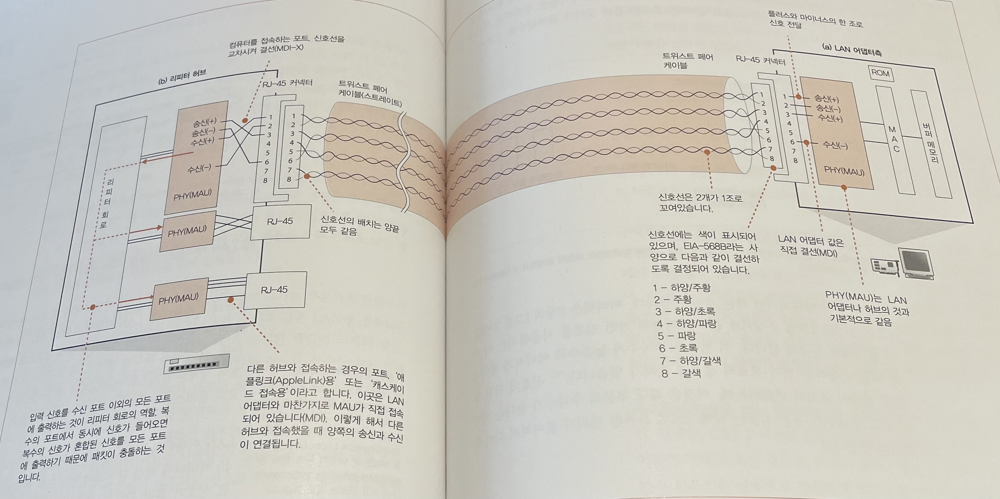
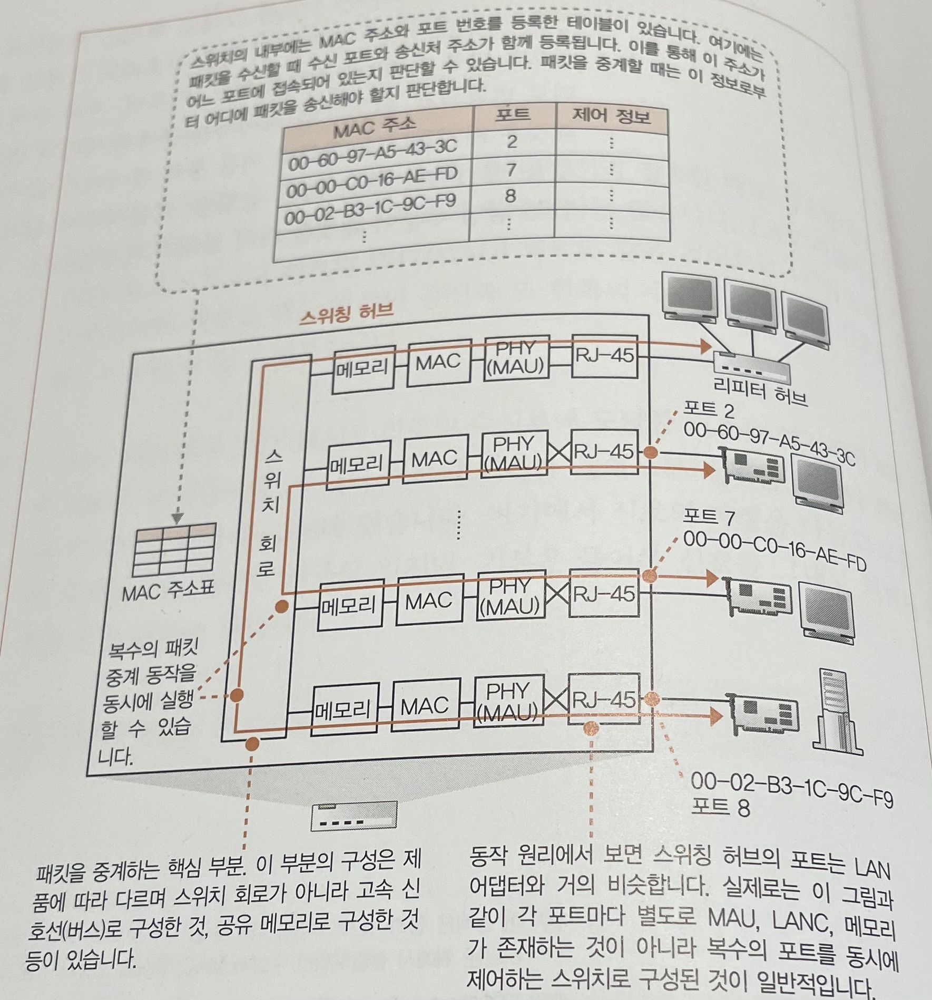
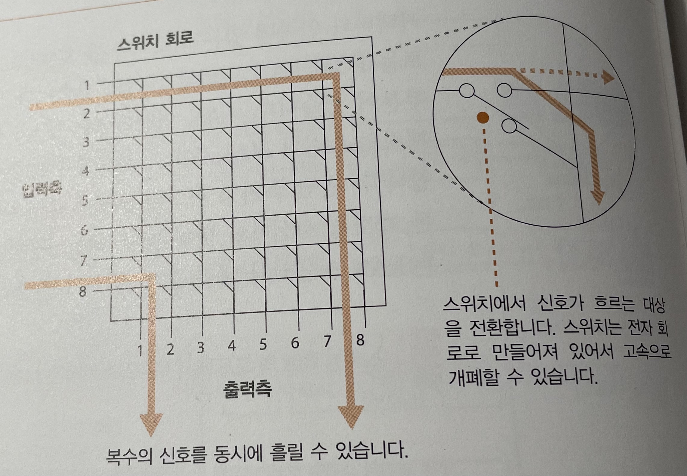
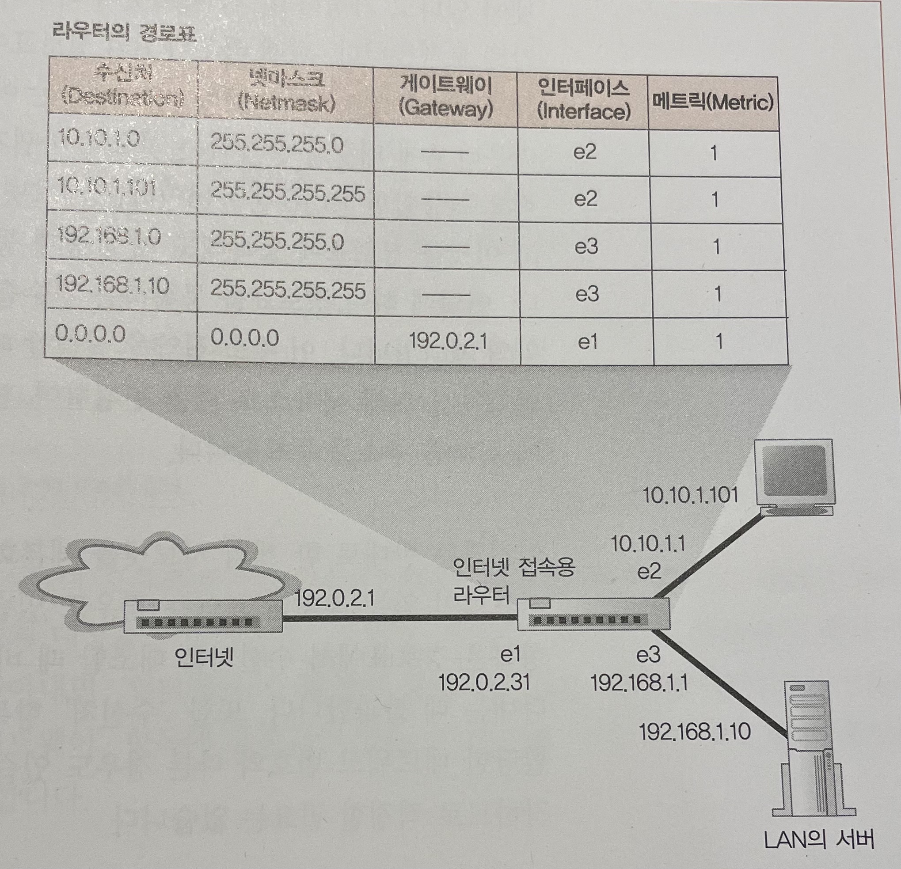
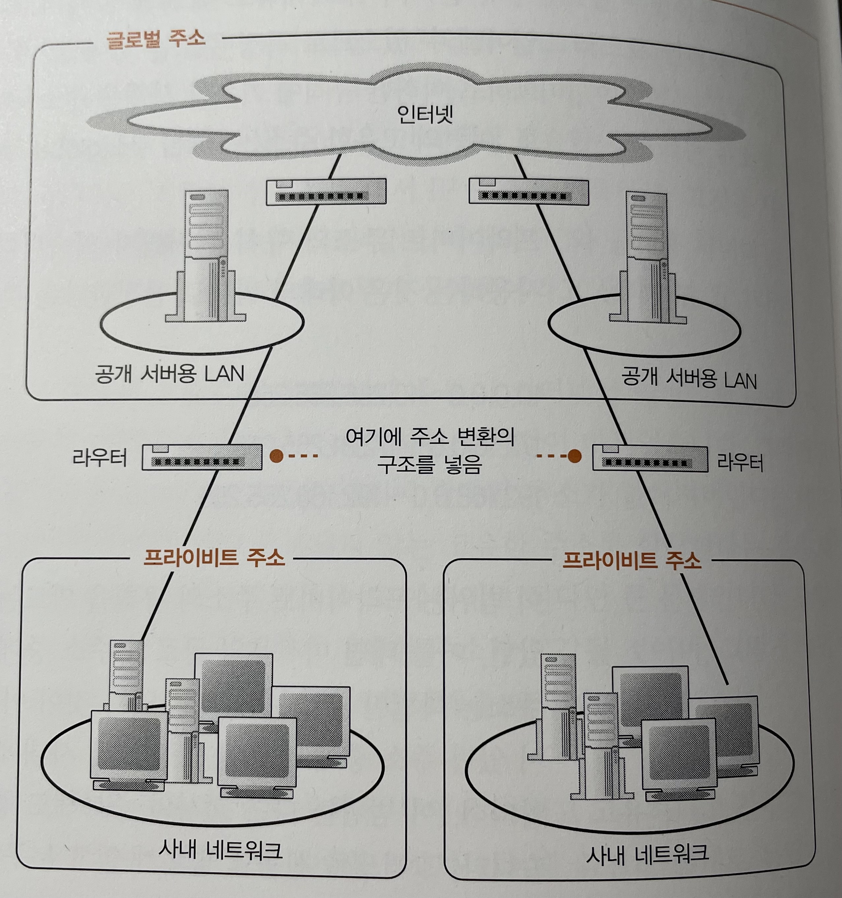
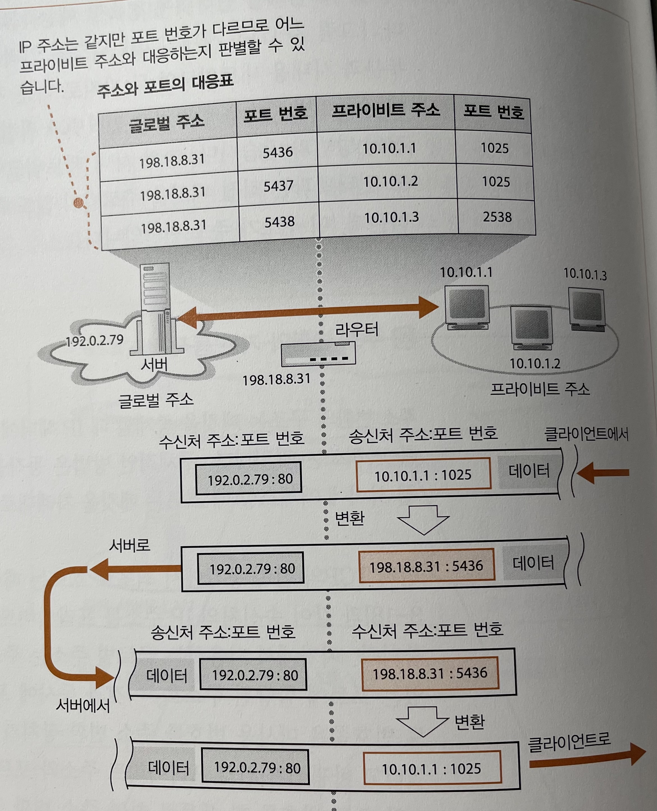

# STORY 01 케이블과 리피터, 허브 속을 신호가 흘러간다

## 1. 하나하나의 패킷이 독립된 것으로 동작한다

- 컴퓨터에서 송신된 패킷은 허브나 라우터라는 중계 장치에 의해 목적지로 도달한다.
    - 패킷 헤더의 제어정보와 중계 장치가 관리하는 정보를 비교하여 중계한다.
- 내용의 예시는 ‘클라이언트 PC - 리피터 허브 - 스위칭 허브 - 라우터’ 의 구조(LAN) 로 되어 있다고 가정하여 설명한다.
    - 일반 가정집에서는 위와 같이 단일 기능의 기기들로 연결되어 있는 형태보다는 복합 기능을 수행하는 기기로 이루어진 경우가 많다.

## 2. LAN 케이블은 신호를 약화시키지 않는 것이 핵심이다

- LAN 케이블은 전기 신호를 다음 중계 장치에게 전달한다.
    - RJ-45 커넥터의 두 개의 신호가 하나의 전기 신호 쌍이다.
        - 하나는 + 신호를, 하나는 - 신호를 보낸다.
    - 두 개의 신호선은 꼬여있는 상태로 구성되어 있다. (트위스트 페어 케이블)
- 송출한 신호는 다음 중계 장치에 도착할 때에는 조금 약해져 있다.
    - 케이블의 길이가 길어질 수록 신호가 약해진다.
    - 디지털 데이터는 사각형의 각진 신호이지만, 전기 신호는 완만한 그래프 형태이다.
        - 주파수가 높을 수록 전기 신호로 변환하는 과정에서 데이터의 변형이 크다.
    - 잡음이 있을 경우 신호의 파형이 왜곡된다.
- 변형된 신호를 디지털 신호로 변환하는 과정에서 잘못 판독하여 통신 오류가 발생할 수 있다.
- LAN 케이블은 이러한 경우를 방지하기 위해 신호선을 꼬아놓은 상태로 관리한다.

## 3. ‘꼼’ 은 잡음을 방지하기 위한 방법이다

- 잡음은 외부의 전자파에 의해 발생할 수 있다.
    - 전자파는 금속 등의 도전체에 닿으면 전류를 발생시키는 성질이 있다.
        - 모니터, 형광등, CRT 모니터 등에서 전자파가 발생할 수 있다.
    - LAN 케이블의 신호선은 금속으로 이루어져 있어 주변에 전자파가 있을 경우 또 다른 전기 신호가 발생하여 잡음이 생길 수 있다.
    - 전자파로 인해 생긴 전류를 상쇄하기 위해 신호선을 꼬아서 관리한다.
        - 전자파로 생긴 전류는 왼쪽에서 오른쪽으로 흐른다는 성질이 있다.
        - 오른쪽에서 왼쪽으로 흐르는 전기 신호에 닿으면 잡음이 상쇄된다.
        - 꼬임의 간격이 좁을 수록 효과가 좋다.
- 잡음은 내부의 신호선에서 발생한 전자파에 의해 발생할 수 있다.
    - 신호선 안에 전류가 흐르므로 전류에 의해 주위에 전자파가 발생할 수 있다. (crosstalk)
    - 매우 가까이에서 발생한 전자파를 상쇄하기 위해 꼬임의 간격을 다양하게 관리한다.
        - 꼬임의 간격이 다르면 어떤 경우에는 플러스 신호가 가깝고, 어떤 경우에는 마이너스 신호가 가깝다.
        - 플러스와 마이너스의 경우 잡음의 영향이 반대가 되어 균형이 잡히면서 잡음의 영향이 줄어든다.
    - 신호선 사이에 구분판이나 피복을 입히는 등의 방법도 있다.

## 4. 리피터 허브는 연결되어 있는 전체 케이블에 신호를 송신한다

- LAN 케이블을 통해 리피터 허브에 신호가 들어온다.
    - PHY(MAU) 회로는 송신 단자와 수신 단자가 구분되어 있다.
    - 송신 단자로 들어온 신호는 수신 단자로 수신해야 한다.
    - 허브의 경우 커넥터 사이의 구성이 적절하도록 설정해야 한다.
        - 허브의 커넥터는 MDI/MDI-X 로 구분된다.
            - MDI : RJ-45 커넥터와 신호 송수신 회로를 직접 결선한 것
            - MDI-X : MDI 를 교차하여 결선한 것
        - 허브 사이의 연결 시 MDI 와 MDI-X 끼리 연결해야 하며, 종류가 같을 경우 크로스 케이블을 사용해야 한다.
    - PC 의 경우 크로스 케이블을 사용해야 한다.
        - 두 개의 PC 를 직접 케이블로 연결할 경우 송수신 단자의 위치가 동일하므로 크로스 케이블을 사용해야 한다.
- 리피터 허브에서 PHY(MAU) 회로의 수신부에 도달한 신호는 리피터 회로에 들어간다.
    - 리피터 회로는 리피터 허브의 커넥터 부분에 뿌리는 역할을 한다.
        - 제품에 따라 신호의 파형을 다듬고 오류를 억제하는 제품도 있다.
    - 모든 커넥터에 신호가 나가면 리피터 허브에 접속한 전체 기기에 도달한다.

# STORY 02 스위칭 허브의 패킷 중계 동작

## 1. 스위칭 허브는 주소 테이블로 중계한다

- LAN 어댑터와는 달리 스위칭 허브는 자신의 MAC 주소를 검사하지 않기 때문에 스위칭 허브의 포트에는 MAC 주소가 할당되어 있지 않다.
    - 스위칭 허브는 접근한 모든 패킷을 수신한다.
    - PHY(MAU) 회로에 들어온 신호를 MAC 회로가 받아 디지털 신호로 변환한다.
    - 디지털로 신호 변환 후 FCS 를 대조하여 오류 검사 후 버퍼 메모리에 저장한다.
- 스위칭 허브는 이더넷의 패킷을 그대로 목적지로 중계하도록 설계되었다.
- 스위칭 허브에서 관리하는 MAC 표를 이용하여 목적지 MAC 주소에 연결되어 있는 포트를 찾아 해당 경로로 신호를 송신한다.
    - 스위치 회로를 이용하여 적절한 포트에게 신호를 전달한다.
        - 스위치 회로는 입력측(수신측)과 출력측(송신측)으로 나누어져 있다.

      

        - MAC 주소에 연결되어 있는 포트에 도달하면 스위치 값을 변경하여 신호를 전달한다.
    - 각 스위치는 독립적이므로 신호가 중복되지 않는다면 여러 개의 신호가 동시에 흐를 수 있다.
    - 송신 측의 포트에 패킷을 운반하면 MAC 회로나 PHY(MAU) 회로가 송신 동작을 실행하고 케이블에 신호가 흘러간다.
        - 앞전의 송신 동작이 끝나거나 아무도 송신하지 않을 경우에 송신한다.
        - 소켓을 디지털 데이터에서 신호로 변환하여 송신한다.

## 2. MAC 주소 테이블을 등록 및 갱신한다

- MAC 주소 테이블은 자동으로 데이터를 관리하여 직접 갱신할 필요가 없다.
- MAC 주소 테이블의 정보를 등록한다.
    - 패킷을 수신했을 경우 송신처 MAC 주소와 수신한 포트 번호 정보를 등록한다.
- MAC 주소 테이블의 정보를 삭제한다.
    - 연결 정보가 변경되었을 경우를 위해 일정 시간(약 몇 분)이 지나면 정보를 삭제한다.

## 3. 예외적인 동작

- 스위칭 허브는 패킷을 수신한 포트와 송신하는 포트가 같을 경우 패킷을 폐기한다.
    - 두 개의 PC 가 하나의 리피터 허브에 연결되어 있고, 리피터 허브가 스위칭 허브에 연결되어 있는 경우 발생할 수 있다.
    - A PC 가 리피터 허브에게 송신하고, 리피터 허브는 B PC 와 스위칭 허브에게 송신한다.
    - 스위칭 허브는 MAC 주소 테이블을 조사하니 수신한 포트와 송신한 포트가 리피터 허브로 같아 동일한 곳에 송신한다.
    - 리피터 허브는 A PC 와 B PC 에게 송신한다.
    - 즉, B PC 는 동일한 요청을 두 번 받을 수 있기 때문에 송수신 포트가 같을 경우 폐기한다.
- MAC 주소 테이블에 송신할 기기 정보가 없을 경우 연결된 모든 포트에게 요청한다.
    - 수신한 포트 외에 모든 포트에게 패킷을 송신하여 송신할 기기의 MAC 주소를 조사한다.
    - 받아온 정보를 MAC 주소 테이블에 갱신한다.

## 4. 전이중 모드에서 송신과 수신을 동시에 실행한다

- 리피터 허브는 반이중 모드이기 때문에 송수신 동작을 동시에 수행할 수 없다.
- 하지만 리피터 허브를 제외하고는 송수신 동작이 별개로 처리된다.
    - 트위스트 페어 케이블의 신호선은 송신용과 수신용이 분리되어 있다.
    - PHY(MAU) 회로와 MAC 회로의 내부도 송신 단자와 수신 단자가 나누어져 있다.
- 성능 향상을 위해 송수신 동작을 동시에 실행할 수 있는 전이중 모드가 생겼다.
    - 신호의 충돌을 검출하는 회로가 무효화된 것이 전이중 모드이다.

## 5. 최적의 전송 속도로 보내는 자동 조정

- 전이중 모드가 등장함에 따라 기존의 반이중 모드에서 전이중 모드로 자동으로 전환하는 기능이 추가되었다.
- 또한, 상대의 전송 속도를 검출하여 전송 속도 또한 자동으로 전환할 수 있다. ⇒ 자동 조정
- 이더넷은 데이터가 흐르고 있지 않을 때 링크 펄스가 흐르는데 이를 이용한다.
    - 홀수 번째 펄스는 신호의 타이밍을 잡기 위한 것으로 일정 간격으로 송신한다.
    - 짝수 번째 펄스는 의미가 담긴 신호로, 이를 해석하여 정보를 얻는다.
- 연결 되어 있는 기기에게 링크 펄스를 보내 상대방에게 자신이 지원할 수 있는 정보를 전달한다.
- 미리 정의되어 있는 우선순위 기준으로 양측이 모두 해당하는 가장 높은 우선순의 정보가 선택된다.
    - 전송 속도가 모드 선택보다 우선순위가 높다.
    - 전송 속도는 빠를 수록 우선순위가 높다.
    - 전이중 모드가 반이중 모드보다 우선순위가 높다.

## 6. 스위칭 허브는 복수의 중계 동작을 동시에 실행한다

- 스위칭 허브는 송신 포트 한 곳에만 패킷을 송신하기 때문에 여러 개의 패킷을 한번에 중계할 수 있다.

# STORY 03 라우터의 패킷 중계 동작

## 1. 라우터의 기본

- 중계 부분은 패킷의 중계 대상을 판단하는 동작을 담당한다. (라우팅 테이블)
- 포트 부분은 패킷을 송수신하는 동작을 담당한다.
    - 포트 부분에 연결한 하드웨어에 따라 다양한 통신 기술을 지원한다. (이더넷, 무선 LAN, 통신 회선)
- 포트 부분에서 수신한 패킷을 라우팅 테이블과 비교하여 적절한 포트에서 송신 동작을 실행한다.
- 스위칭 허브는 들어온 패킷을 전송하지만, 라우터는 수신 후 송신 동작을 실행하는 것에 차이가 있다.

## 2. 경로표에 등록된 정보

- MAC 주소로 판단하는 스위칭 허브와는 달리, 라우터는 IP 주소로 중계 대상을 판단한다.
- 포트 부분에게 패킷을 전달받으면 수신처(서브넷)와 넷마스크 정보를 비교하여 어느 네트워크에게 온 패킷인지 판단한다.
    - 수신처는 여러 개의 서브넷을 하나의 서브넷으로 묶어 관리할 수도 있다. (주소 집약)
        - 10.10.1.0/24 + 10.10.2.0/24 + 10.10.3.0/24 = 10.10.0.0/16
        - 10.10.0.0/16 - 라우터 A - 라우터 B
        - 넷마스크 정보를 변경하여 주소 집약을 수행할 수 있다.
    - 반대로 하나의 서브넷을 여러 개의 서브넷으로 분리하여 관리할 수도 있다.
- 수신처와 넷마스크로 적절한 행을 찾은 후 ‘게이트웨이’ 와 ‘인터페이스’ 로 송신할 포트를 찾는다.
- ‘매트릭’ 은 수신처 IP 주소에 기록되어 있는 목적지의 거리를 숫자로 표현한다. (작을수록 가깝다)
- 라우팅 테이블은 스위칭 허브의 MAC 주소 테이블과는 달리 패킷 중계 시 갱신하지 않는다.
    - 사람이 수동으로 경로 정보를 갱신한다.
    - 라우팅 프로토콜을 이용하여 라우터들끼리 경로 정보를 교환하고 갱신한다.
        - 라우팅 프로토콜 : RIP, OSPF, BGP 등

## 3. 라우터의 패킷 수신 동작

- 라우터의 포트에는 MAC 주소가 할당되어 있으며, 라우터는 자신의 주소에 해당하는 패킷만 수신하고 아닐 경우 폐기한다.
    - 신호가 커넥터에 들어오면 PHY 회로를 거쳐 MAC 회로에게 전달된다.
    - MAC 회로에서 신호를 디지털 데이터로 변환 후 오류를 검사하여 정상이면 수신 버퍼 메모리에 저장한다.
    - 수신처 MAC 주소가 본인의 MAC 주소와 다를 경우 패킷을 폐기한다.

## 4. 경로표를 검색하여 출력 포트를 발견한다

- 라우터는 패킷 수신 동작이 끝나면 맨 앞의 MAC 헤더를 폐기한다.
    - 패킷의 MAC 헤더의 값은 라우터를 찾기 위한 정보이다.
- IP 헤더의 정보와 라우팅 테이블의 정보를 비교하여 패킷을 송신할 포트를 찾는다.
    - 라우팅 테이블의 ‘수신처’ 와 ‘넷마스크’ 정보를 비교하여 적절한 행을 찾는다.
    - 해당되는 행이 여러 개일 경우 네트워크 번호가 긴(호스트 번호가 짧은) 행을 선택한다.
        - 호스트 번호가 짧을 수록 서브넷 크기가 작으며, 범위가 축소된다는 것을 의미한다.
    - 네트워크 번호도 같을 경우 ‘매트릭’ 정보를 이용한다.
- 라우팅 테이블에 매칭되는 정보가 없을 경우 패킷은 폐기한다.
    - 송신처에게 ICMP 메시지를 보내 폐기 사실을 통지한다.
        - Internet Control Message Protocol
        - 패킷을 운반할 때 발생하는 오류를 통지하거나 제어용 메시지를 보낼 때 사용한다.
    - 스위칭 허브의 경우 연결되어 있는 기기가 많아봤자 수천대이므로 중계 대상 정보가 없을 경우 모든 포트에 패킷을 뿌리는 것이 큰 부담이 아니다.
    - 하지만 라우터의 경우 규모가 전세계에 걸쳐있기 때문에 패킷을 뿌리는 것이 아닌 폐기하는 방법을 선택했다.

## 5. 해당하는 경로가 없는 경우에 선택하는 기본 경로

- 라우팅 테이블에 매칭되는 정보가 없을 경우를 대비하여 기본 경로를 설정할 수 있다.
    - 넷마스크가 0.0.0.0 일 경우 네트워크 번호에 해당하는 부분이 없어 항상 해당된다.
    - 해당 행의 게이트웨이를 인터넷에 연결하여 처리할 수 있다. (기본 게이트웨이)

## 6. 패킷은 유효 기간이 있다

- IP 헤더 필드에는 TTL(Time To Live) 라는 패킷의 생존 시간을 나타내는 필드가 있다.
- 라우터를 경유할 때마다 1씩 줄이다가 0이 되면 패킷이 만료되어 패킷을 폐기한다.
    - 패킷이 같은 장소만 계속해서 순회하는 경우를 막기 위한 방식이다.
    - 라우팅 테이블이 올바르게 구성되어 있으면 발생하지 않는다.
    - 기본 64(또는 128) 로 설정한다. (전세계 라우터는 수십개 정도이다)

## 7. 큰 패킷은 조각 나누기 기능으로 분할한다

- 라우터에 연결된 회선이나 LAN 의 종류에 따라 수용할 수 있는 패킷의 최대 길이가 다르다.
- 수신한 패킷을 적절한 포트에 송신할 때 송신 포트의 MTU 를 조사하여 적절한 크기의 패킷으로 분할한다.
- 중계 장치에서 수용할 수 있도록 패킷의 크기를 분할하는 과정을 fragmentation(조각 나누기) 라고 한다.
    - 이는 TCP 계층에서 데이터를 분할하는 과정과 다르다.
    - TCP 계층에서 데이터 분할 후 전송된 패킷을 라우터의 IP 계층에서 별도로 이루어진다.
- 송신 포트의 MTU 를 조사하여 패킷을 분할해야 하는지 판단한다.
    - 송신 포트의 MTU 가 충분히 크다면 패킷을 분할하지 않고 그대로 송신한다.
    - 수신 포트보다 송신 포트의 MTU 가 작다면 패킷을 분할하여 송신한다.
        - IP 계층을 기준으로 IP 데이터(TCP 헤더 + 데이터) 를 분할 후 MAC 헤더와 IP 헤더를 붙인다.
        - IP 헤더에 분할한 내용을 작성한다.
    - IP 헤더에 플래그 필드가 분할 불가로 되어 있으면 패킷을 폐기하고 수신처에 ICMP 메시지를 통지한다.

## 8. 라우터의 송신 동작은 컴퓨터와 같다

- 라우터 송신 동작은 송신 포트 하드웨어에 따라 방식이 다르다.
- 이더넷의 경우 프로토콜 스택의 IP 담당 부분이 패킷을 보낼 때와 같다.
    - 패킷의 맨 앞부분에 MAC 헤더를 부가하고, 값을 설정한 후 전기신호로 변환하여 송신한다.
    - 라우팅 테이블의 ‘게이트웨이’ 의 값이 있을 경우 해당 IP 주소가 수신처이다.
    - 값이 없을 경우 현재 패킷의 IP 헤더 수신처 IP 주소가 수신처이다.
    - 수신처의 IP 주소가 결정되면 ARP 를 이용하여 MAC 주소를 조사 후 MAC 헤더에 설정한다.
    - 송신처 MAC 주소는 송신 포트의 MAC 주소를 작성한다.

## 9. 라우터와 스위칭 허브의 관계

- 라우터는 IP 를, 스위칭 허브는 이더넷에 기초하기 때문에 라우터와 스위칭 허브의 관계는 IP 와 이더넷의 관계이다.
- IP 가 이더넷에 의뢰하는 것은 최종 목적지가 아닌 다음 라우터에 패킷을 운반하는 것이다.
    - 라우터(IP)는 통신 상대까지 패킷을 전달하는 역할을 담당한다.
    - 스위칭 허브(이더넷)는 다음 라우터까지 패킷을 운반하는 역할을 담당한다.

# STORY 04 라우터의 부가 기능

## 1. 주소 변환으로 IP 주소를 효율적으로 이용한다

- 기기를 식별하기 위해 주소(IP) 를 사용한다.
- 인터넷 시장이 커지면서 할당할 수 있는 주소가 고갈될 것이 예측되어 중복되어도 되는 주소는 중복으로 관리하였다.
    - 외부에 노출되지 않는 사내 네트워크의 경우 해당 네트워크 내에서만 주소가 중복되지 않으면 된다.
    - 이러한 점을 이용하여 사내 네트워크 주소를 중복적으로 사용하며 주소의 고갈을 막았다.
        - 10.0.0.0 ~ 10.255.255.255
        - 172.16.0.0 ~ 172.31.255.255
        - 192.168.0.0 ~ 192.168.255.255
    - 다만 사내 네트워크도 인터넷에 연결되어야 하기 때문에 이를 위해 라우터에서 주소 변환을 지원한다.

## 2. 주소 변환의 기본 동작

- 사내 네트워크와 통신 시 라우터는 주소 변환을 통해 실제 IP 와는 다른 주소로 통신한다.
- 사내 네트워크에서 외부 기기에 송신할 때 적절한 IP 주소와 포트로 변환하여 송신한다.
    - 글로벌 주소는 주소 변환 장치의 인터넷 측 포트의 할당된 주소이다.
    - 포트 번호는 미사용 번호를 적당히 선택해서 사용한다.
    - 변환 정보들을 대응표에 갱신한다.
- 인터넷에서 사내 네트워크로 응답을 수신한다.
    - 주소 변환 장치는 대응표를 대조하여 수신처를 찾고 패킷을 전달한다.
    - 데이터 송수신 종료 후 연결 끊기 동작마저 끝나면 대응표 내용을 삭제한다.

## 3. 포트 번호를 바꿔쓰는 이유

- 초기에는 포트 번호는 그대로 사용하고 글로벌 주소만 변경하였다.
- 다만 이 방법은 프라이빗 주소에 대응되는 글로벌 주소가 1 대 1 의 비율로 필요하다.
- 글로벌 주소의 수를 줄이기 위해 무작위 포트 번호로 프라이빗 기기를 선택하는 방식이 고안되었다.

## 4. 인터넷에서 회사로 액세스한다

- 인터넷에서 사내로 패킷을 중계할 때는 대응표에 등록되어 있지 않으면 중계할 수 없다.
    - 사내에서 인터넷으로 통신할 때 대응표에 데이터가 추가된다.
    - 즉 사내에서 의도적으로 인터넷에 액세스하지 않는 한 인터넷 측에서 사내에 패킷을 보낼 수 없다.
- 라우터의 대응표를 수동으로 추가한다면 가능하다.

## 5. 라우터의 패킷 필터링 기능

- 패킷 필터링 기능으로 부정 침입을 방지하는 기능도 제공한다.
    - MAC, IP, TCP 헤더를 조사하여 정상 접근만 허용한다.
