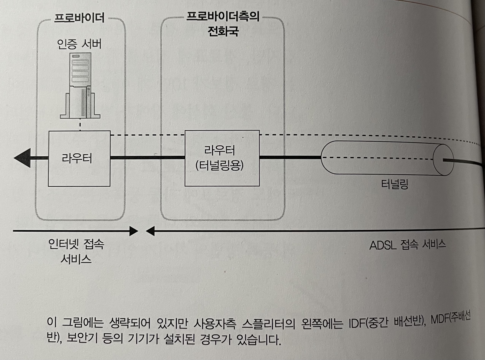
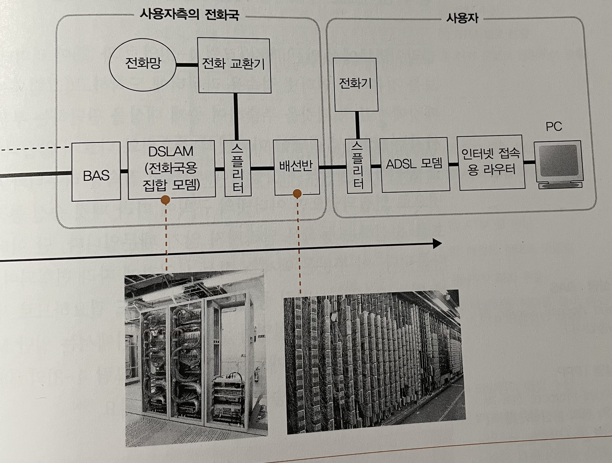
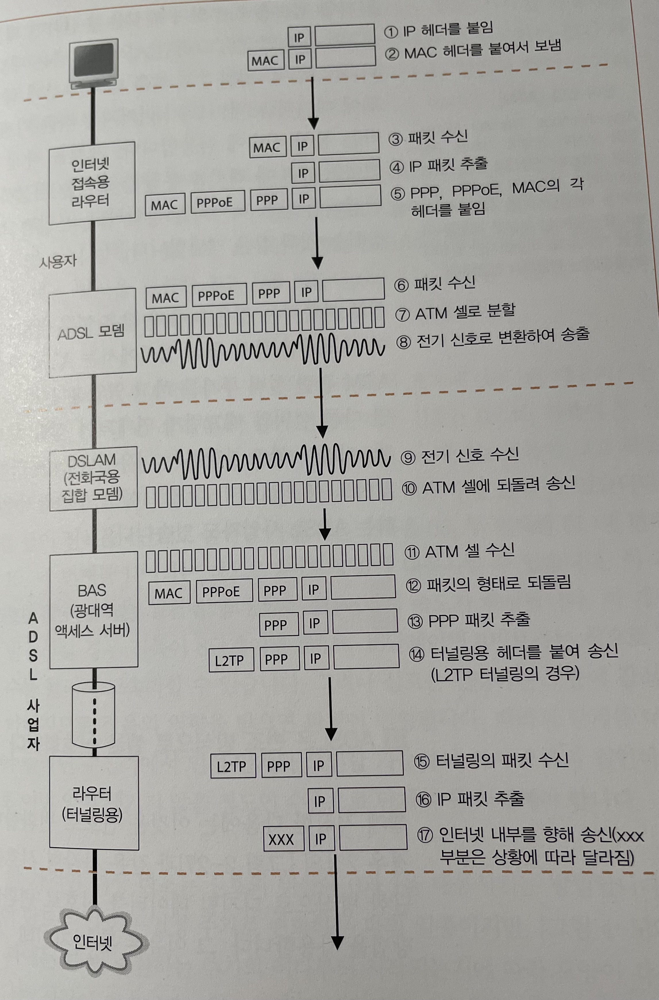

# STORY 01 ADSL 기술을 이용한 액세스 회선의 구조와 동작

## 1. 인터넷의 기본은 가정이나 회사의 LAN 과 같다

- 라우터에서 패킷을 중계하는 부분은 가정이나 회사의 LAN 모두 같다.
    - 라우터의 기본적인 구조나 동작도 동일하다.
- 다만, 인터넷의 라우터의 경우 경로 정보가 보통 10만개 이상이므로 자동화가 필수적으로 필요하다.
    - 회사의 라우터의 경우 자동 등록 방식이 있지만, 여러 이유로 인해 인터넷의 라우터와는 다른 구조로 이루어져 있다.

## 2. 사용자와 인터넷을 연결하는 액세스 회선

- 사용자 — (가정용) 라우터 -**(액세스 회선)**- (인터넷 접속용) 라우터 — … — 라우터 — 서버
- 액세스 회선 : 인터넷과 가정 또는 회사의 LAN 을 연결하는 통신 회선, 가정용 라우터와 인터넷 접속용 라우터를 연결짓기 위한 통신 회선
- 인터넷 접속용 라우터의 패킷 중계 동작도 패킷의 IP 헤더에 기록된 수신처 IP 주소와 경로표의 수신처 항목을 대조하여 해당하는 경로를 찾아 중계 대상에 패킷을 송신한다.
- 단, 인터넷 접속용 라우터와 연결된 액세스 회선의 규칙에 따라 패킷 송신 동작이 다르다.

## 3. ADSL 모델에서 패킷을 셀로 분할한다

- 사용자 측의 라우터에서 송신된 패킷은 ADSL 모뎀이나 전화의 케이블을 통해 전화국으로 도착한다.
- 여기에 ADSL 사업자의 네트워크를 경유하여 프로바이더(ISP: Internet Service Provider) 에 도착한다.
- 프로바이더에 도착하기 전까지 패킷은 여러 형태로 변형되며 진행된다.
    - 1 ~ 2) 클라이언트에서 패킷을 만든다.
    - 3) 리피터 허브나 스위칭 허브를 경유하여 인터넷 접속용 라우터에 도착한다.
    - 4) 이더넷의 패킷에서 IP 의 패킷을 추출하여 중계 대상을 판단한다.
    - 5) MAC 헤더, PPPoE 헤더, PPP 헤더가 추가되고 이더넷의 규칙에 따라 신호로 변환하여 송신한다.
    - 6) 인터넷 접속용 라우터가 패킷을 송신하면 패킷은 ADSL 모뎀에 도착한다.
    - 7) ADSL 모뎀은 패킷을 잘게 분할하여 셀에 저장한다.
        - 셀 : 헤더(5바이트) + 데이터(48바이트) 로 이루어진 작은 디지털 데이터 덩어리
        - 셀은 ATM(Asynchronous Transfer Mode) 이라는 통신 기술에 사용한다.
        - 패킷을 셀로 분할하고, 전기 신호로 바꾸어 스플리터에 송신한다.

## 4. ADSL 은 변조 방식으로 셀을 신호화한다

- 8) 패킷의 데이터를 셀에 저장 후 신호로 변환한다.
    - LAN 의 경우 0과 1을 나타내는 간단한 방식의 디지털 데이터 신호로 변환한다.
    - ADSL 모뎀의 경우 완만한 파형(정현파)을 합성한 신호에 0과 1의 비트 값을 대응시킨다. (변조 기술)
        - 디지털 신호는 파형이 뭉개지기 쉽고 거리가 먼 경우에 오류를 일으키기 쉽다.
        - 디지털 신호에는 낮은 주파수에서 높은 주파수까지 넓은 범위의 주파수가 포함되어 있다.
        - 신호의 주파수가 높아지면 주위에 방사되는 잡음의 양이 증가한다.
    - ADSL 는 진폭 변조(ASK)와 위상 변조(PSK)를 결합한 직교 진폭 변조(QAM)를 사용한다.
        - 진폭 변조 : 진폭이 작은 신호는 0으로, 진폭이 큰 신호는 1로 대응시킨다.
        - 위상 변조 : 신호의 위상에 따라 0과 1을 대응시킨다.
        - 직교 진폭 변조 : 신호의 진폭과 위상에 각각 1비트를 대응시키고, 한 개의 파에 2비트 분의 데이터를 대응시킨다.
        - 모든 변조에서 기준을 세분화하여 전달 데이터의 수를 늘릴 수 있다.

## 5. ADSL 은 파를 많이 사용하여 고속화를 실현한다

- ADSL 은 다수의 파에 비트값을 대응시켜 고속화를 구현한다.
- 단, 잡음이나 감쇠 등의 회선 특성은 전화 회선마다 다르기 때문에 회선의 상태를 조사하여 사용할 파의 수나 각 파에 대응하는 비트 수를 조절한다.
    - 잡음이 없는 주파수의 파에는 다수의 비트를 대응시키고, 잡음이 있는 주파수의 파에는 소수의 비트를 대응시킨다.
- 각 파에 대응시킨 비트 수를 합계한 값에 의해 전체의 전송 속도가 결정된다.

## 6. 스플리터의 역할

- 사용자 측에서 신호를 전화 회선에 송출할 때 스플리터가 따로 수행하는 일은 없다.
    - ADSL 의 신호와 전화의 음성 신호가 섞여 그대로 전달된다.
- 반대로 수신할 때에는 ADSL 의 신호와 전화의 음성 신호를 분리한다.
    - ADSL 의 높은 주파수 신호를 차단하여 음성 신호만 전화기측에 전달한다.
    - ADSL 모뎀의 내부에는 ADSL 의 주파수를 벗어날 경우 차단하는 기능이 있으므로 그대로 전달한다.
        - 다만, 스플리터가 없을 때 전화선이 연결되면(수화기를 들면) ADSL 의 신호가 잡음에 영향을 받을 수 있으므로 스플리터가 필요하다.

## 7. 전화국까지의 여정

- 스플리터 → 전화 케이블의 모듈형 커넥터 → IDF나 MDF → 보안기 → 전주의 전화 케이블
    - IDF나 MDF : 배선반
    - 보안기 : 낙뢰와 같이 전화선에 과대한 전류가 흐르지 않도록 보호하는 것
- 전주의 전화 케이블의 경우 수많은 케이블이 관리되기 때문에 지하로에서 관리한다.

## 8. 잡음의 영향

- 디지털 신호와는 달리, ADSL 의 신호는 다수의 주파수로 나누어져 잡음과 주파수가 겹치는 신호만 영향을 받아 사용할 수 없게 된다.
    - 사용할 수 있는 신호의 수가 감소하여 속도가 저하된다.

## 9. DSLAM 을 통과하여 BAS 에 도달한다

- 9) 전화 케이블을 통해 전화국에 도착한 신호가 배선반과 스플리터를 통과하여 DSLAM 에 도착한다.
- 10) 전기 신호가 디지털 데이터의 셀로 복원된다.
    - DSLAM 이 신호의 파형을 읽어 진폭과 위상을 조사하고, 대응되는 비트값을 판단하여 디지털 데이터로 복원한다.
    - 사용자 측의 ADSL 와 동일한 작업을 하므로, 다수의 ADSL 모뎀에 해당하는 기능을 묶은 DSLAM 을 사용한다.
    - DSLAM 은 이더넷 대신 대부분 ATM 인터페이스를 사용하여, 패킷을 분할한 셀 그대로 수신한다.
- 11) DSLAM 을 나온 셀은 BAS 라는 패킷 중계 장치에 도착한다.
    - BAS 에도 ATM 인터페이스가 있으며, 여기에서 수신한다.
- 12) BAS 의 ATM 인터페이스에서 셀을 원래의 패킷으로 복원한다.
- 13) 수신한 패킷의 맨 앞 부분에 있는 MAC, PPPoE 헤더를 버리고 PPP 헤더 이후를 추출한다.
- 14) 터널링용 헤더를 붙여 터널링의 출구를 향해 중계한다.
- 15) 패킷은 터널링의 출구에 있는 터널링용 라우터에 도착한다.
- 16) 터널링용 헤더를 분리하고 IP 패킷을 추출한다.
- 17) 인터넷의 내부에 중계한다.

# STORY 02 광섬유를 이용한 액세스 회선(FTTH)

## 1. 광섬유의 기본

- 액세스 회선 중 FTTH 는 광섬유를 사용한다.
- 디지털 신호를 광신호로 변환하기 위해 전기 신호로 변환 후 광신호로 변환한다.
- 광신호는 밝은 상태가 1을, 어두운 상태가 0을 나타낸다.
- 수신측에는 빛에 감응하여 밝기에 따라 전압을 일으키는 수광 소자가 있다.
- 수광 소자는 빛이 닿을 경우 밝으면 높은 전압의 전기 신호를, 어두우면 낮은 전압의 전기 신호를 낸다.
- 이것을 디지털 신호로 변환하여 데이터를 수신한다.

## 2. 싱글모드와 멀티모드의 차이

- 광섬유의 재질에 따라 빛의 투과율이나 굴절률의 차이, 코어의 직경 등이 빛의 전달 방법에 영향을 끼친다.
    - 광원에서 나온 빛의 각도(입사각)가 큰 경우 코어와 클래드의 경계면에 굴절되어 밖으로 나가게된다.
        - 입사각이 작은 빛만 경계면에 전반사되어 코어 속으로 진행된다.
    - 위상에 차이가 생기는 경우 빛이 서로 상쇄되어 도중에 소멸되고, 차이가 없는 경우에만 코어 속으로 진행된다.
- 코어는 직경에 따라 싱글모드(8~10mm) 와 멀티모드(50mm 또는 62.5mm) 로 분류된다.
    - 싱글모드 : 위상이 같은 각도 중에서 가장 각도가 작은 빛만 들어가도록 코어의 직경을 가늘게 만든 것
    - 멀티모드 : 복수의 빛을 수용할 수 있도록 코어의 직경을 넓게 만든 것
    - 광원이나 수광 소자의 성능 : 싱글모드 > 멀티모드
    - 신호의 변형 유무 : 싱글모드 X / 멀티모드 O
        - 싱글모드는 신호의 변형이 적어 멀티모드보다 케이블을 길게 사용할 수 있다.

## 3. 광섬유를 분기시켜서 비용을 절감한다

- ADSL 대신 광섬유를 사용하여 사용자 측의 인터넷 접속용 라우터와 인터넷 측의 BAS 로 접속하는 것이 FTTH 액세스 회선이다.
- 한 개의 광섬유를 이용하여 사용자 측과 가장 가까운 전화국 측을 연결한다.
    - 프로바이더 { 라우터 } — 프로바이더 측의 전화국 { 라우터(터널링용) } —(터널링)— 가장 가까운 전화국 { BAS - 집합형 미디어 컨버터 } —(1개의 광섬유)— 사용자 { 미디어 컨버터 - 인터넷 접속용 라우터 - PC }
    - 사용자 측의 미디어 컨버터에서 이더넷의 전기 신호가 광신호로 변환된다.
    - 광섬유는 외길로 BAS 의 바로 앞에 있는 집합형의 미디어 컨버터에 연결되어 있으므로 그 속을 광신호가 흘러 들어간다.
    - 집합형 미디어 컨버터에서 전기 신호로 복원되어 BAS 의 포트가 수신하고 인터넷 내부로 패킷을 중계한다.
    - 한개의 광섬유로 관리하면 송수신 파장이 섞이는데, 프리즘의 원리로 분리할 수 있다. (파장 다중)
- 복수의 사용자를 연결하기 위해 광스플리터라는 분기 장치를 사용하여 연결할 수도 있다.
    - 프로바이더 { 라우터 } — 프로바이더 측의 전화국 { 라우터(터널링용) } —(터널링)— 가장 가까운 전화국 { BAS - OLT } —(광스플리터)— 사용자 { ONU - 인터넷 접속용 라우터 - PC }
    - 광스플리터에 복수의 사용자(ONU) 가 연결되어 있는 형태이다.
    - 미디어 컨버터 대신 ONU 가 이더넷 신호를 광신호로 변환하여 OLT 에게 전달한다.
    - 복수의 사용자를 대응하기 위해 패킷 충돌을 방지하는 기능이 탑재되어 있다.
        - 사용자 송신 : OLT 가 수신할 수 있는 타이밍을 ONU 에게 전달한다.
        - 사용자 수신 : ONU 에서 식별자로 구분하여 본인의 신호만 수신한다.

# STORY 03 액세스 회선으로 이용하는 PPP 와 터널링

## 1. 본인 확인과 설정 정보를 통지한다

- 프로바이더 : 인터넷 및 네트워크 접속에 필요한 대역을 서비스하는 사업자
- BAS : 액세스 회선에 연결하는 라우터의 상위 버전
- BAS 는 본인 확인 및 설정값 통지 기능을 제공한다.
    - 인터넷에 접속하기 위해서는 인증 서버에게 적절한 IP 주소를 할당받아야 한다.
    - 인증을 받기 위해선 로그인 동작을 수행해야 하는데 BAS 는 로그인 동작의 창구 역할이다.
        - 1) 프로바이더의 액세스 포인트에 전화를 건다.
        - 2) 전화가 연결된다.
        - 3) 사용자명과 패스워드를 입력하여 로그인을 수행한다.
            - 원격 액세스 서버(RAS) 에서 로그인 인증이 처리된다.
        - 4) 인증이 되면 인증 서버에서 IP 주소 등의 설정 정보가 반송된다.
        - 5) 사용자의 PC 는 이 정보에 따라 IP 주소 등을 설정한다.
        - 6) TCP/IP 패킷 송수신 동작이 수행된다.

## 2. 이더넷에서 PPP 메시지를 주고받는 PPPoE

- PPP 의 메시지를 운반하기 위해서 IP 패킷을 이더넷의 패킷에 넣어 운반하는 것과 마찬가지로, HDLC 프로토콜 사양을 선택했다.
    - HDLC 는 전용선(통신 회선)에서 사용하는 프로토콜로, 일부 수정해서 사용한다.
- 다만 ADSL 이나 FTTH 의 경우 HDLC 를 허용하지 않아 이더넷 프로토콜을 사용한다.
    - 이더넷과 PPP 는 개념이 다른 부분이 있어 PPPoE 라는 프로토콜을 만들어 사용한다.

## 3. 터널링 기능에 의해 프로바이더에 패킷을 전달한다

- BAS 는 본인 확인 기능과 함께 터널링을 통해 패킷을 운반하는 기능도 제공한다.
    - 터널링은 TCP 커넥션과 유사하다.
    - BAS 와 프로바이더의 라우터 사이에 터널이 만들어지고, 그 사이에서 패킷이 송수신된다.
- TCP 의 커넥션을 이용하여 터널링을 구현할 수 있다.
    - 네트워크에 설치한 터널링용 라우터 사이에 TCP 커넥션을 생성한다.
    - 커넥션의 양 끝의 소켓에 해당하는 부분을 라우터의 포트로 간주하고 패킷을 송수신한다.
    - 커넥션은 케이블 역할을 하고, 패킷이 그 안을 통해 반대쪽으로 도착한다.
- 패킷 캡슐화를 통해서도 터널링을 구현할 수 있다.
    - 헤더와 패킷 전체를 별도의 패킷에 저장하여 캡슐화 헤더를 붙여 새로운 패킷을 만든다.
    - 캡슐화된 패킷을 터널의 한쪽 출입구까지 운반한다.
- 패킷을 그대로의 모습으로 운반하는 모든 방식을 터널링이라고 부른다.

## 4. 액세스 회선 전체의 동작

- 사용자 측에 인터넷 접속용 라우터를 설치하고 인터넷에 접속한다.
    - 인터넷 접속용 라우터에 프로바이더가 할당한 사용자명과 패스워드를 등록한다.
    - 브로드캐스트를 통해 BAS 의 MAC 주소를 조회한다.
    - 인증 서버로부터 IP 정보들을 받아온다.
- TCP/IP 의 설정 정보를 통지한다.
    - **인터넷에 접속하는 기기에 할당한 IP 주소, DNS 서버의 IP 주소, 기본 게이트웨이의 IP 주소**
    - 설정 정보를 인터넷 접속용 라우터가 받아서 라우터 자체에 설정한다.
        - 글로벌 IP 주소 할당 및 경로표에 기본 게이트웨이를 설정한다.
- BAS 에게 패킷을 송신한다.
    - 인터넷 접속용 라우터에서 BAS 에게 패킷을 송신하기 위해 필요한 헤더를 덧붙인다.
        - MAC 헤더, PPPoE 헤더, PPP 헤더
            - 수신처 MAC 주소 : PPPoE 로 조사한 BAS 의 MAC 주소
            - 송신처 MAC 주소 : 인터넷 접속용 라우터의 BAS 측 포트 MAC 주소
    - BAS 에 도착하면 MAC 헤더, PPPoE 헤더를 제거하고 PPP 헤더 이후를 추출하여 터널링을 통해 패킷을 송신한다.
- PPP 패킷은 터널링을 통해 프로바이더 라우터에 도착한다.

## 5. IP 어드레스를 할당하지 않는 언넘버드

- 라우터의 포트끼리 하나의 케이블로 연결되어 있을 경우 기본 게이트웨이의 값은 의미가 없다.
- 이런 경우 게이트웨이 값을 기록하지 않으며 중계 대상 라우터의 포트에 IP 또한 할당하지 않는다. (언넘버드)

## 6. 인터넷 접속용 라우터에서 프라이비트 주소를 글로벌 주소로 변환한다

- 인터넷 접속용 라우터를 사용하면 BAS 에서 받은 글로벌 IP 주소를 인터넷 접속용 라우터에 할당한다.
- PC 에도 적절한 IP 를 할당하기 위해 프라이비트 주소를 할당하고, 인터넷 접속용 라우터에서 주소 변환을 수행한다.

## 7. PPPoE 이외의 방식

- PPPoE 외에 PPPoA 통신 방법도 있다.
- PPPoE 는 PPP 메시지를 이더넷의 패킷에 저장 후 셀에 저장하지만, PPPoA 는 PPP 메시지를 그대로 셀에 저장한다.
- PPPoA 는 이더넷의 패킷을 사용하지 않으므로 MTU 가 짧아지지 않아, 효율성이 떨어지지 않는다.
