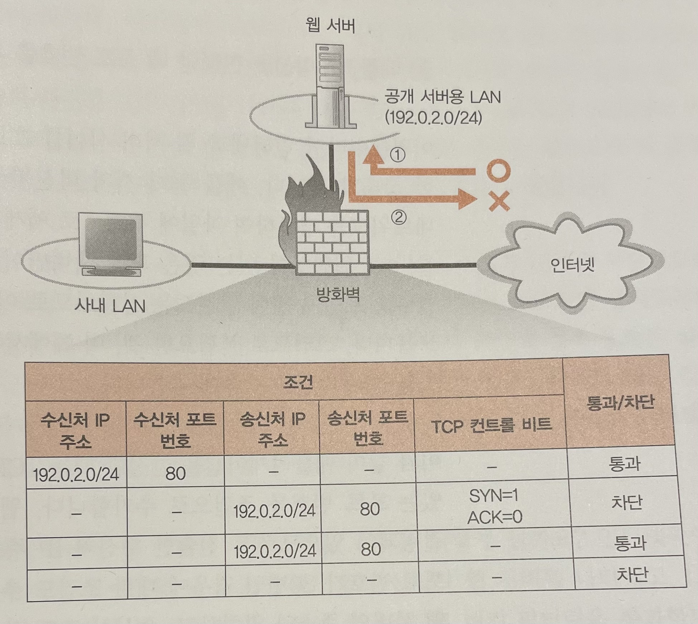

# STORY 01 웹 서버의 설치 장소

## 1. 사내에 웹 서버를 설치하는 경우

- 인터넷을 통해 들어온 패킷이 서버에 도착할 때, 서버의 설치 방식에 따라 도착하는 과정이 다르다.
- 1) 라우터에서 직접 연결하는 경우
    - 패킷은 가장 가까운 POP 에 있는 라우터, 액세스 회선, 서버측 라우터를 경유하여 서버에 도착한다.
    - IP 주소의 부족 및 보안상의 이유로 현재는 주로 사용하는 방법이 아니다.
- 2) 방화벽으로 분리하는 경우
    - 특정 서버의 특정 애플리케이션의 액세스만 허용하고 그 외의 패킷은 차단한다.

## 2. 데이터센터에 웹 서버를 설치하는 경우

- 회사 안에 설치하는 것 외에 데이터 센터의 웹 서버를 사용할 수도 있다.
    - 데이터센터 시설에 서버를 설치하거나 프로바이더가 소유하는 서버를 대여할 수 있다.
- 데이터센터는 프로바이더의 중심 부분에 있는 NOC 에 직접 연결되거나 IX 에 직결되어 고속으로 액세스할 수 있다.
- 어느 경우든지 패킷이 라우터에서 중계되고 서버에 도착한다는 점은 동일하다.

# STORY 02 방화벽의 원리와 동작

## 1. 패킷 필터링형이 주류이다

- 서버의 설치 장소와 관계 없이 방화벽을 설정하는 것이 기본이다.
- 방화벽을 구현하기 위해서 다양한 방법이 있지만 최근에는 패킷 필터링형이 가장 많이 사용된다.
- 특정 서버의 특정 애플리케이션만 허용한다.

## 2. 패킷 필터링의 조건 설정 개념

- 패킷의 헤더에 있는 제어 정보를 보고 판단한다.
- 예를 들어, 인터넷에서 웹 서버로의 접속은 허용하되, 그 반대의 경우는 허용하지 않는다고 가정해보자.
- 가장 먼저 수신처의 IP 주소를 보고 통과하도록 설정되어 있으면 접속을 허용한다. (1행)

## 3. 애플리케이션을 한정할 때 포트 번호를 사용한다

- 웹 서버의 기본 포트는 80번 이므로 수신처 포트가 80번인 패킷은 허용하도록 설정되어 있다.

## 4. 컨트롤 비트로 접속 방향을 판단한다

- 웹의 대부분의 동작은 TCP 프로토콜을 사용하며, 이는 양방향 통신의 특징을 가진다.
- 즉, 한 방향의 통신을 제어하면 이후의 요청이 연결되지 않아 통신을 할 수 없게 된다.
- TCP 는 접속 단계의 동작에서 3개의 패킷이 흐르는데, 최초의 패킷의 경우 SYN 는 1, ACK 는 0 이다.
- 웹 서버에서 인터넷으로의 통신을 차단하고 싶을 경우 최초 패킷을 차단하여 앞으로의 통신을 제어할 수 있다. (2행)
- 인터넷에서 웹 서버로 들어오는 최초의 패킷의 경우 TCP 컨트롤 비트에 대한 조건이 없고, 해당 설정이 통과로 되어 있으므로 통신이 가능하다. (1행)
- IP 및 포트번호, TCP 컨트롤 비트 조건 외에도 다양한 헤더 정보를 이용하여 차단을 설정할 수 있다.
- 다만, UDP 의 경우 TCP 접속 단계가 없으므로 컨트롤 비트를 이용하여 액세스 방향을 판별할 수 없다.

## 5. 사내 LAN 에서 공개 서버용 LAN 으로 조건을 설정한다

- 사내 LAN 과 공개 서버용 LAN 에서의 통신을 위해서 관련 조건을 추가해야 한다.
- 다만, 사내용 LAN 과의 편리한 통신을 위해 공개 서버용 LAN 에 들어온 요청을 모두 허용하도록 설정하면 인터넷의 패킷을 모두 허용하게 되므로 주의해야 한다.

## 6. 밖에서 사내 LAN 으로 액세스 할 수 없다

- 패킷 필터링형 방화벽은 패킷 차단 기능뿐만 아니라 주소 변환 기능도 가지고 있다.
- 사내 LAN 과 인터넷 사이의 설정 시 패킷 차단 설정을 포함하여 주소 변환 기능도 설정해야 한다.

## 7. 방화벽을 통과한다

- 패킷 조건이 ‘차단’ 일 경우 패킷을 폐기하고 이를 기록한다.
- 패킷 조건이 ‘통과’ 일 경우 패킷을 중계하는데, 이는 라우터와 동일하다.

## 8. 방화벽으로 막을 수 없는 공격

- 방화벽은 패킷 흐름의 시점과 종점만을 보고 판단하므로 패킷 데이터에 문제가 있을 경우 차단하지 못한다.

# STORY 03 복수 서버에 리퀘스트를 분배한 서버의 부하 분산

## 1. 처리 능력이 부족하면 복수 서버로 부하 분산된다

- 서버에 액세스가 증가할 경우 분산 처리를 통해 서버의 처리량을 줄일 수 있다.
    - 복수의 서버를 사용하여 처리를 분담하는 방법이다.
- DNS 서버에 하나의 도메인에 복수의 IP 를 등록해놓으면 간단하게 분산 처리를 할 수 있다. (RR)
- 단, DNS 서버는 웹서버의 상황을 모르기 때문에 웹서버에서 문제가 있을 경우에도 요청을 보낼 수 있다.

## 2. 부하 분산 장치를 이용해 복수의 웹 서버로 분할된다

- 웹서버의 상태를 파악하여 효율적으로 처리하기 위해 DNS 서버가 아닌 부하 분산 장치 또는 로드 밸런서가 고안되었다.
- DNS 서버에는 부하 분산 장치를 등록하고, 부하 분산 장치로 요청이 들어오면 여러 웹서버 사이의 요청을 조정한다.
    - 웹 서버와 정기적으로 정보를 교환하여 CPU 나 메모리의 사용률을 수집하고 웹 서버의 부하가 낮은 곳으로 요청할 수 있다.
    - 테스트 패킷을 요청보내 응답 시간을 기준으로 부하를 판단하기도 한다.
    - 테스트가 잦아질 경우 테스트 자체가 부하가 될 수 있기 때문에 웹 서버의 사양에 따라 요청 비율을 미리 설정해둘 수도 있다.
- 이전의 요청을 이어서 처리해야 하는 경우 이전에 요청했던 서버의 정보가 필요하다.
    - HTTP 헤더를 이용하여 이전 서버의 정보를 담기도 한다.
